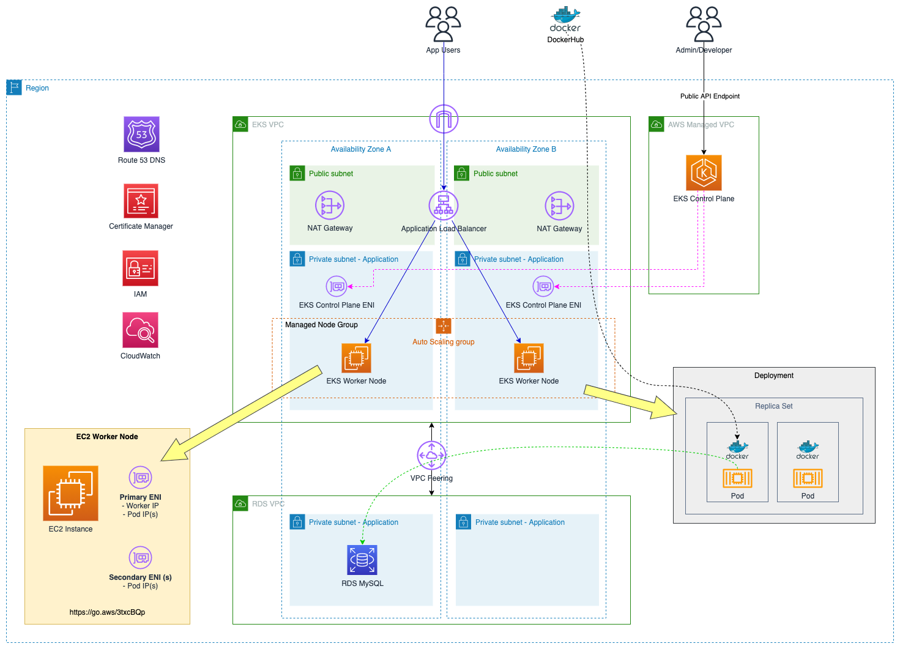

# EKS Presentation Indonesia Belajar Channel

In this demo we will deploy the simple phonebook application to the Elastic Kubernetes Service (EKS) cluster. We will use sample phonebook application. This is NodeJS-based simple CRUD system which is built using ExpressJS, Sequelize, and MySQL database. You can see [**this quick video**](https://staticweb.awsbuilder.xyz/demophonebook.mp4) showing how the application looks like.

The following diagram depict the architecture of the application:



Here is some details of the architecture:

1. Amazon Relational Database Service (RDS):
	- We will use MySQL database (version 5.7) for persistent data store.
	- RDS will be hosted in the separate VPC than the EKS.
	- For the demo we will use only Single-AZ database. It is recommended to use Multi-AZ setup for production workload to get highly availability protection.
2. VPC Peering will be used to connect EKS Virtual Private Cloud (VPC) to the RDS networks. 
3. Container image will be pulled from public Docker Hub repository, thus we need to put NAT Gateway to enable internet access.
4. AWS Elastic Kubernetes Service:
	- We will deploy the cluster using `eksctl` tool.
	- We will use Kubernetes version v.1.21.
	- The cluster will consist of single managed node group with 2 worker nodes. Auto scaling group will be created automatically with minimum node 1 & maximum node 4. 
	- Managed node group will use `privateNetworking: true` - it means  that all EC2 instances will be deployed in private subnet.
	- We will use public EKS endpoint.
	- We will enable cluster logging using AWS CloudWatch.
	- We will enable OIDC with IAM integration
5. To expose the application we will use 2 approach:
	- First we will use in-tree controller that will create Classic Load Balancer


## 🚀 Prerequisites

1. Install [AWS CLI](https://docs.aws.amazon.com/cli/latest/userguide/install-cliv2.html). Follow by setup AWS CLI using `aws configure` command. You can reuse credential from existing
IAM users or [create new one](https://aws.amazon.com/premiumsupport/knowledge-center/create-access-key/).

2. Setup AWS Credentials with required privileges (e.g. for testing we can use `AdministratorAccess` policy), can be using Access Key & Secret Key in the profile `~/.aws/credentials` and make sure you already set the targeted AWS region in  `~/.aws/config`.

3. Install `eksctl` tool as per guide available in [documentation](https://eksctl.io/introduction/#installation). In Linux, you can using the following command:

    ```
    curl --silent --location "https://github.com/weaveworks/eksctl/releases/latest/download/eksctl_$(uname -s)_amd64.tar.gz" | tar xz -C /tmp

    sudo mv /tmp/eksctl /usr/local/bin
    ```

    `eksctl` is a simple CLI tool for creating clusters on EKS - Amazon's new managed Kubernetes service for EC2. It is written in Go, and uses CloudFormation.

4. Install `kubectl` tool as per [official documentation](https://kubernetes.io/docs/tasks/tools/). For example in Amazon Linux 2 you can use the following command (as root):

    ```
    cat <<EOF > /etc/yum.repos.d/kubernetes.repo
    [kubernetes]
    name=Kubernetes
    baseurl=https://packages.cloud.google.com/yum/repos/kubernetes-el7-x86_64
    enabled=1
    gpgcheck=1
    repo_gpgcheck=1
    gpgkey=https://packages.cloud.google.com/yum/doc/yum-key.gpg https://packages.cloud.google.com/yum/doc/rpm-package-key.gpg
    EOF

    yum install -y kubectl
    ```

5. Install `helm` tool for Kubernetes package manager, similar with `yum` or `apt` in Linux. Refer to [this documentation](https://docs.aws.amazon.com/eks/latest/userguide/helm.html) fo
r detail installation steps. Example command to install in Linux:

    ```
    curl https://raw.githubusercontent.com/helm/helm/master/scripts/get-helm-3 > get_helm.sh;
    chmod 700 get_helm.sh;
    ./get_helm.sh;
    ```

6. Install `jq` & `git` tool. Example command to install: `sudo yum install -y jq git`

7. Before installing AWS CDK, you need to install NodeJS (refer to [this link](https://docs.aws.amazon.com/sdk-for-javascript/v2/developer-guide/setting-up-node-on-ec2-instance.html) for complete tutorial)

    ```
    curl -o- https://raw.githubusercontent.com/nvm-sh/nvm/v0.34.0/install.sh | bash
    . ~/.nvm/nvm.sh
    nvm install node
    ```

    Verify node installation using this command:
    ```
    node -e "console.log('Running Node.js ' + process.version)"
    ```

8. Install AWS CDK as described in this document. We will use AWS CDK version 2.

    ```
    npm install -g aws-cdk@2
    ```

    As I write this document, CDK v2 latest version is 2.17.0. Test your CDK installation using the following command:

    ```
    cdk --version
    ```

9. Clone the repo `https://github.com/ttirtawi/indonesiabelajar-eks` to your local environment.

	```
	git clone https://github.com/ttirtawi/indonesiabelajar-eks
	```

## 🚀 Deployment Steps

In this demo we will split the activities into several sections:

1. Prepare RDS MySQL database
2. Deploy EKS Cluster
3. Create VPC Peering
4. Create Kubernetes deployment
5. Expose the service
6. Install AWS Load Balancer Controller add-on

### 🔥 Prepare RDS MySQL database

The stack to deploy RDS MySQL are located in `mysqldatabase` folder. There are some predefined values in the stack:

- Database name `mydb`.
- Database username `mydbuser`.
- Database VPC CIDR range `10.10.0.0/24`.
- Database security group that wide open for internal RDS VPC as well as EKS VPC (`172.11.0.0/16`).

To deploy the stack follow the following steps:

1. Go to the `mysqldatabase` folder:

	```
	cd mysqldatabase 
	```

2. Deploy the CDK stack using the following commands:

	```
	cdk deploy
	```

	You will be asked to confirm the deployment by typing `Yes/Y`.

    **Remember**: if you haven't use the CDK before, you must run `cdk bootstrap` first.

3. Wait for a moment until the deployment completed. You will see the output similar to the screenshot below

	

	You will see few output values, please keep it handy since we will need those later:
	
	- `vpcId`: you will need the VPC ID value later when creating VPC Peering.
	- `secretId`: you will need the Secret ID value to retrieving database password.
	- `dbHost`: this is database endpoint URL, you will need this value later when creating Kubernetes Secret. 

4. To get the password of the MySQL database, execute the following command (replace SECRET_ID with the `secretId` value ):

	```
	aws secretsmanager get-secret-value --secret-id <SECRET_ID> --query SecretString --output text | jq -r .password
	```
    Keep the password safe, we will going to need it when creating Kubernetes Secret.

### 🔥 Deploy EKS Cluster

1. Go back to the project root directory.

	```
	cd ..
	```

2. We will use `cluster.yml` as cluster definition template. This will create a new EKS cluster named `indonesiabelajar` in Singapore (`ap-southeast-1`) region. 

    To deploy the cluster using the file, execute the following command:

    ```
    eksctl create cluster -f cluster.yml
    ```

3. When `eksctl` completed cluster creation, it will automatically add new entry in your `~/.kube/config` file & activate the context. You can test by checking the worker node status using the following command:

	```
	kubectl get nodes
	```

4. To proceed to the next steps, we need to populate VPC ID that has been created using the following command:

	```
	aws eks describe-cluster --name indonesiabelajar --query cluster.resourcesVpcConfig.vpcId --output text
	```

### 🔥 Create VPC Peering

In this section we will setup [VPC peering](https://docs.aws.amazon.com/vpc/latest/peering/what-is-vpc-peering.html) so that our EKS cluster can talk to the RDS MySQL we had created earlier. 

Up until now you already have 2 VPC ID, execute the command below:

```
bash createPeering.sh -s <RDS_VPC_ID> -d <EKS_VPC_ID> -n <PEERING_NAME> -a CREATE
```

The script above will:

1. Create VPC peering between RDS VPC & EKS VPC
2. Update the route tables on each VPC to add remote CIDR route via VPC Peering.

To validate the peering setup, we can launch a pod and do telnet test against the MySQL database:

```
kubectl run -i --tty --rm testpeering --image=busybox --restart=Never -- sh
```

When prompt come up execute `echo 'exit' | telnet <RDS_hostname> 3306` like the following example:

```
> kubectl run -i --tty --rm testpeering --image=busybox --restart=Never -- sh
If you don't see a command prompt, try pressing enter.
/ # echo 'exit' | telnet mysqldatabasestack-mysql-database.cseijjkokper.ap-southeast-1.rds.amazonaws.com 3306
Connected to mysqldatabasestack-mysql-database.cseijjkokper.ap-southeast-1.rds.amazonaws.com
/ # exit
pod "testpeering" deleted
>
```

You will see "Connected to" message that indicates both peering & route table already updated properly.

### 🔥 Create Kubernetes deployment

1. First we need to create Kubernetes Secret to store database details. We will use the template `secret.yml` file located in the project root folder which looks like this:

	  ```
    apiVersion: v1
    kind: Secret
    metadata:
        name: dbsecret
    type: Opaque
    stringData:
        username: "mydbuser"
        password: "<DB_PASSWORD>"
        dbhost: "<DB_HOSTNAME>"
        dbname: "mydb"
        dbport: "3306"
	  ```

	Update the password & RDS MySQL endpoint. Execute the following command to create the secret:

	```
	kubectl apply -f secret.yml
	```

2. Next we will create the Kubernetes Deployment using the existing template called `deployment.yml` which looks like this:

	```
	apiVersion: apps/v1
	kind: Deployment
	metadata:
	  name: phonebook-deployment
	  labels:
	    app: phonebook
	spec:
	  replicas: 2
	  selector:
	    matchLabels:
	      app: phonebook
	  template:
	    metadata:
	      labels:
	        app: phonebook
	    spec:
	      containers:
	      - name: web
	        image: tedytirta/sample-phonebook-app
	        ports:
	        - containerPort: 8080
	        env:
	          - name: DB_HOST
	            valueFrom:
	              secretKeyRef:
	                name: dbsecret
	                key: dbhost
	          - name: DB_DATABASE
	            valueFrom:
	              secretKeyRef:
	                name: dbsecret
	                key: dbname
	          - name: DB_PORT
	            valueFrom:
	              secretKeyRef:
	                name: dbsecret
	                key: dbport
	          - name: DB_USERNAME
	            valueFrom:
	              secretKeyRef:
	                name: dbsecret
	                key: username
	          - name: DB_PASSWORD
	            valueFrom:
	              secretKeyRef:
	                name: dbsecret
	                key: password
	```

	You don't need to change anything in this file. To deploy the file execute the following command:

	```
	kubectl apply -f deployment.yml
	```

3. To check deployment result we can use the following command:

	```
	kubectl get pod -w
	```
	
	You should see 2 pods has been created.


### 🔥 Expose the service

Now we have already couple pods already running. We need to expose the pods using Kubernetes Service so that we can access the application from the internet.

Run the following command to create Kubernetes Service:

```
kubectl expose deployment phonebook-deployment --port=80 --target-port=8080 --type=LoadBalancer
```

The command above will create `LoadBalancer` Service using in-tree Kubernetes legacy controller. The legacy in-tree controller will create AWS Classic Load Balancer facing the internet. Execute the following command to check the status:

```
kubectl get service phonebook-deployment
```

You will see the domain name of Classic Load Balancer under EXTERNAL-IP column. It might take few seconds before the CLB is fully provisioned. 

Verify the result by opening the URL in the web browser. You should able to access the application.


You can try to insert some data using Phonebook menu to validate the database connection.

### 🔥 Install AWS Load Balancer Controller add-on

In the previous step we alreaady able to expose our application using AWS Classic Load Balancer. However it still use Kubernetes legacy in-tree controller. The new approach is to use AWS Load Balancer Controller. Using AWS Load Balancer controller you can create the following:

1. Kubernetes Service as AWS Network Load Balancer
2. Kubernetes Ingress as AWS Application Load Balancer

To deploy AWS Load Balancer controller you can execute the following 5 commands (don't forget to update `clusterName` if you use the different cluster name other than `indonesiabelajar`):

```
curl -o iam_policy.json https://raw.githubusercontent.com/kubernetes-sigs/aws-load-balancer-controller/v2.4.1/docs/install/iam_policy.json

aws iam create-policy \
    --policy-name AWSLoadBalancerControllerIAMPolicy \
    --policy-document file://iam_policy.json

helm repo add eks https://aws.github.io/eks-charts

helm repo update

helm install aws-load-balancer-controller eks/aws-load-balancer-controller -n kube-system --set clusterName=indonesiabelajar --set serviceAccount.create=false --set serviceAccount.name=aws-load-balancer-controller
```

Use the following command to validate the result:

```
kubectl get deployment -n kube-system aws-load-balancer-controller
```

Using the Application Load Balancer controller, we will deploy another Service & Ingress as follow:

1. We will create Service using existing file `service-nlb.yml`, let's examine the content:

	```
	apiVersion: v1
	kind: Service
	metadata:
      name: service-nlb
      labels:
        app: phonebook
      annotations:
        service.beta.kubernetes.io/aws-load-balancer-type: nlb
	spec:
      selector:
        app: phonebook
      ports:
        - name: http
          protocol: TCP
          port: 80
          targetPort: 8080
      type: LoadBalancer
	```

    To create the Service execute the following command:

    ```
    kubectl apply -f service-nlb.yml
    ```

2. To check the output use the following command:

    ```
    kubectl get service service-nlb
    ```

    You can find the Network Load Balancer (NLB) DNS name under EXTERNAL-IP column.

3. Now we will create Ingress using existing file `ingress.yml`, let's examine the content:

    ```
    apiVersion: networking.k8s.io/v1
    kind: Ingress
    metadata:
      name: "ingress-http"
      annotations:
        kubernetes.io/ingress.class: alb
        alb.ingress.kubernetes.io/scheme: internet-facing
        alb.ingress.kubernetes.io/target-type: ip
    spec:
      rules:
        - http:
            paths:
            - path: /
              pathType: Prefix
              backend:
                service:
                  name: service-nlb
                  port:
                    number: 80  
    ```

    To create the Ingress execute the following command:

    ```
    kubectl apply -f ingress.yml
    ```

4. To check the output use the following command:

    ```
    kubectl get ingress ingress-http
    ```

     You can find the Application Load Balancer (ALB) DNS name under ADDRESS column.

5. (Optional) We have the option to create HTTPS load balancer as well. The difference in manifest only on the Certificate CRN and the domain name. You need to store/create SSL Certificate in the AWS Certificate Manager. 

    ```
    apiVersion: networking.k8s.io/v1
    kind: Ingress
    metadata:
      name: "ingress-https"
      annotations:
        kubernetes.io/ingress.class: alb
        alb.ingress.kubernetes.io/scheme: internet-facing
        alb.ingress.kubernetes.io/target-type: ip
        alb.ingress.kubernetes.io/certificate-arn: <CERT_ARN>
    spec:
      rules:
        - host: <DOMAIN_NAME>
          http:
            paths:
            - path: /
              pathType: Prefix
              backend:
                service:
                  name: service-nlb
                  port:
                    number: 80  
    ```


## 🚀 Cleanup

At this point you already able to:

1. Create a RDS MySQL Database using AWS CDK. 
2. Create an EKS cluster with AWS Load Balancer controller.
3. Create VPC Peering.
4. Deploy a sample application & expose the HTTP service using an AWS Network Load Balancer.
5. Create Kubernetes Ingress to expose HTTP service using AWS Application Load Balancer.

For more information visit [EKS documentation page](https://docs.aws.amazon.com/eks/latest/userguide).

Don't forget to clean up the resouces you created in this tutorial. The deletion process must be done in the following order:

1. Delete the VPC peering using the following command:

    ```
    bash createPeering.sh -s <RDS_VPC_ID> -d <EKS_VPC_ID> -n <PEERING_NAME> -a DELETE
    ```

2. Delete EKS Cluster using the following command (change the name of the cluster if you've created the cluster using different name):

    ```
    eksctl delete cluster --name indonesiabelajar
    ```

3. Delete the RDS stack using the following command (this should be done in the CDK folder, i.e. `mysqldatabase`):

    ```
    cd mysqldatabase && cdk destroy
    ```

    You will be asked to confirm the deletion by typing `Yes/Y`.
