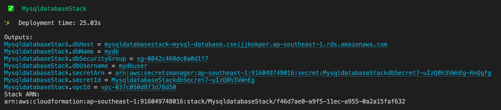

# EKS Presentation Indonesia Belajar Channel

## Introduction

In this demo we will deploy the simple phonebook application to the Elastic Kubernetes Service (EKS) cluster. 

The following diagram depict the architecture of the application:


Here is some details of the architecture:

1. Amazon Relational Database Service (RDS):
	- We will use MySQL database (version 5.7) for persistent data store.
	- RDS will be hosted in the separate VPC than the EKS.
	- For the demo we will use only Single-AZ database. It is recommended to use Multi-AZ setup for production workload to get highly availability protection.
2. VPC Peering will be used to connect EKS Virtual Private Cloud (VPC) to the RDS networks. 
3. Container image will be pulled from public Docker Hub repository, thus we need to put NAT Gateway to enable internet access.
4. AWS Elastic Kubernetes Service:
	- We will deploy the cluster using `eksctl` tool.
	- We will use Kubernetes version v.1.21.
	- The cluster will consist of single managed node group with 2 worker nodes. Auto scaling group will be created automatically with minimum node 1 & maximum node 4. 
	- Managed node group will use `privateNetworking: true` - it means  that all EC2 instances will be deployed in private subnet.
	- We will use public EKS endpoint.
	- We will enable cluster logging using AWS CloudWatch.
	- We will enable OIDC with IAM integration
5. To expose the application we will use 2 approach:
	- First we will use in-tree controller that will create Classic Load Balancer


## Prerequisites

1. Install [AWS CLI](https://docs.aws.amazon.com/cli/latest/userguide/install-cliv2.html). Follow by setup AWS CLI using `aws configure` command. You can reuse credential from existing
IAM users or [create new one](https://aws.amazon.com/premiumsupport/knowledge-center/create-access-key/).

2. Setup AWS Credentials with required privileges (e.g. for testing we can use `AdministratorAccess` policy), can be using Access Key & Secret Key in the profile `~/.aws/credentials` and make sure you already set the targeted AWS region in  `~/.aws/config`.

3. Install `eksctl` tool as per guide available in [documentation](https://eksctl.io/introduction/#installation). In Linux, you can using the following command:

    ```
    curl --silent --location "https://github.com/weaveworks/eksctl/releases/latest/download/eksctl_$(uname -s)_amd64.tar.gz" | tar xz -C /tmp

    sudo mv /tmp/eksctl /usr/local/bin
    ```

    `eksctl` is a simple CLI tool for creating clusters on EKS - Amazon's new managed Kubernetes service for EC2. It is written in Go, and uses CloudFormation.

4. Install `kubectl` tool as per [official documentation](https://kubernetes.io/docs/tasks/tools/). For example in Amazon Linux 2 you can use the following command (as root):

    ```
    cat <<EOF > /etc/yum.repos.d/kubernetes.repo
    [kubernetes]
    name=Kubernetes
    baseurl=https://packages.cloud.google.com/yum/repos/kubernetes-el7-x86_64
    enabled=1
    gpgcheck=1
    repo_gpgcheck=1
    gpgkey=https://packages.cloud.google.com/yum/doc/yum-key.gpg https://packages.cloud.google.com/yum/doc/rpm-package-key.gpg
    EOF

    yum install -y kubectl
    ```

5. Install `helm` tool for Kubernetes package manager, similar with `yum` or `apt` in Linux. Refer to [this documentation](https://docs.aws.amazon.com/eks/latest/userguide/helm.html) fo
r detail installation steps. Example command to install in Linux:

    ```
    curl https://raw.githubusercontent.com/helm/helm/master/scripts/get-helm-3 > get_helm.sh;
    chmod 700 get_helm.sh;
    ./get_helm.sh;
    ```

6. Install `jq` & `git` tool. Example command to install: `sudo yum install -y jq git`

7. Before installing AWS CDK, you need to install NodeJS (refer to [this link](https://docs.aws.amazon.com/sdk-for-javascript/v2/developer-guide/setting-up-node-on-ec2-instance.html) for complete tutorial)

    ```
    curl -o- https://raw.githubusercontent.com/nvm-sh/nvm/v0.34.0/install.sh | bash
    . ~/.nvm/nvm.sh
    nvm install node
    ```

    Verify node installation using this command:
    ```
    node -e "console.log('Running Node.js ' + process.version)"
    ```

8. Install AWS CDK as described in this document. We will use AWS CDK version 2.

    ```
    npm install -g aws-cdk@2
    ```

    As I write this document, CDK v2 latest version is 2.17.0. Test your CDK installation using the following command:

    ```
    cdk --version
    ```

9. Clone the repo `https://github.com/ttirtawi/indonesiabelajar-eks` to your local environment.

	```
	git clone https://github.com/ttirtawi/indonesiabelajar-eks
	```

## Deployment Steps

### Prepare RDS MySQL database

The stack to deploy RDS MySQL are located in `mysqldatabase` folder. There are some predefined values in the stack:

- Database name `mydb`.
- Database username `mydbuser`.
- Database VPC CIDR range `10.10.0.0/24`.
- Database security group that wide open for internal RDS VPC as well as EKS VPC (`172.11.0.0/16`).

To deploy the stack follow the following steps:

1. Go to the `mysqldatabase` folder:

	```
	cd mysqldatabase 
	```

2. Deploy the CDK stack using the following commands:

	```
	cdk deploy
	```

	You will be asked to confirm the deployment by typing `Yes/Y`.

3. Wait for a moment until the deployment completed. You will see the output similar to the screenshot below

	

	You will see few output values, please keep it handy since we will need those later:
	
	- `vpcId`: you will need the VPC ID value later when creating VPC Peering.
	- `secretId`: you will need the Secret ID value to retrieving database password.
	- `dbHost`: this is database endpoint URL, you will need this value later when creating Kubernetes Secret. 
	- 

4. To get the password of the MySQL database, execute the following command (replace SECRET_ID with the `secretId` value ):

	```
	aws secretsmanager get-secret-value --secret-id <SECRET_ID>
	```

### Deploy EKS Cluster

1. Go back to the project root directory.

	```
	cd ..
	```
2. We will use `cluster.yml` as cluster definition template. To deploy the cluster using the file, execute the following command:

	```
	eksctl create cluster -f cluster.yml
	```

	This will create a new EKS cluster named `indonesiabelajar`. 

3. When `eksctl` completed cluster creation, it will automatically add new entry in your `~/.kube/config` file & activate the context. You can test by checking the worker node status using the following command:

	```
	kubectl get nodes
	```

4. To proceed to the next steps, we need to populate VPC ID that has been created using the following command:

	```
	aws eks describe-cluster --name indonesiabelajar --query cluster.resourcesVpcConfig.vpcId --output text
	```

### Create VPC Peering

In this section we will setup [VPC peering](https://docs.aws.amazon.com/vpc/latest/peering/what-is-vpc-peering.html) so that our EKS cluster can talk to the RDS MySQL we had created earlier. 

Up until now you already have 2 VPC ID, execute the command below:

```
bash createPeering.sh -s <RDS_VPC_ID> -d <EKS_VPC_ID> -n <PEERING_NAME> -a CREATE
```

The script above will:
1. Create VPC peering between RDS VPC & EKS VPC
2. Update the route tables on each VPC to add remote CIDR route via VPC Peering.

To validate the peering setup, we can launch a pod and do telnet test against the MySQL database:

```
kubectl run -i --tty --rm testpeering --image=busybox --restart=Never -- sh
```

When prompt come up execute `echo 'exit' | telnet <RDS_hostname> 3306` like the following example:

```
> kubectl run -i --tty --rm testpeering --image=busybox --restart=Never -- sh
If you don't see a command prompt, try pressing enter.
/ # echo 'exit' | telnet mysqldatabasestack-mysql-database.cseijjkokper.ap-southeast-1.rds.amazonaws.com 3306
Connected to mysqldatabasestack-mysql-database.cseijjkokper.ap-southeast-1.rds.amazonaws.com
/ # exit
pod "testpeering" deleted
>
```

You will see "Connected to" message that indicates both peering & route table already updated properly.


### Create Kubernetes deployment

1. Create Secret to store database details. We will use the template below:


	```
	apiVersion: v1
	kind: Secret
	metadata:
		name: dbsecret
	type: Opaque
	stringData:
		username: mydbuser
		password: <DB_PASSWORD>
		dbhost: <DB_HOSTNAME>
		dbname: mydb
		dbport: 3306
	```

	Update the password & RDS MySQL endpoint.

2. 


### Expose the service


1. Create mysql cdk deployment ==DONE==
2. Test the vpc peering script ==DONE==
3. Create deployment with the Kubernetes secret to store the password ==DONE==
4. Install ALB Controller
5. Deploy  

Expose the service using CLB:

```
kubectl expose deployment phonebook-deployment --port=80 --target-port=8080 --type=LoadBalancer
```

Get mysql db password:

```
aws secretsmanager get-secret-value --secret-id <SECRET_ID> --query SecretString --output text | jq -r .password
```

```
kubectl get secret dbsecret -o jsonpath='{.data.password}'
```


Demo step

1. Show the sample running application
2. Describe the application architecture, explain the RDS that already precreated
3. Explain the cluster creation using eksctl
4. Continue presentation
5. When cluster already created, create the peering
6. Populate db credential & create the Kubernetes secret  
7. Create deployment
8. Expose the service using CLB:

	```
	kubectl expose deployment phonebook-deployment --port=80 --target-port=8080 --type=LoadBalancer
	```

9. Setup application load balancer controller
10. Create service & ingress
11. Optional create https ingress

